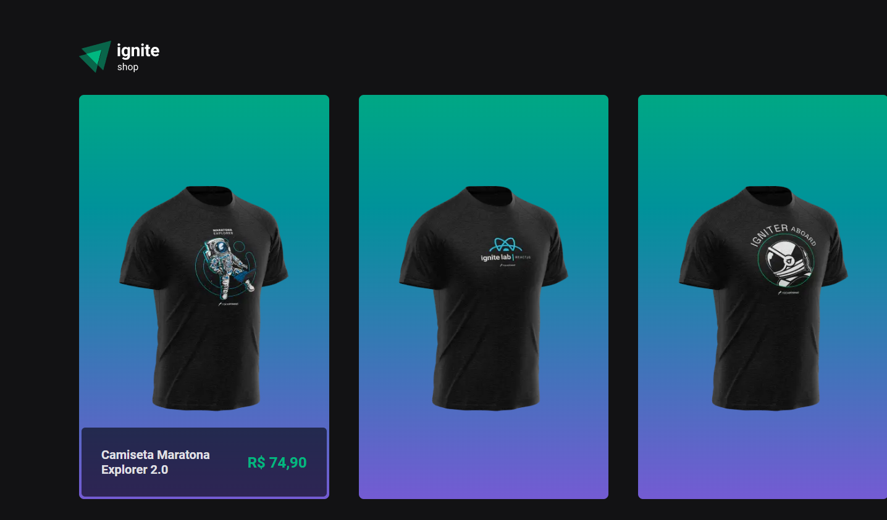

<h1 align="center">
    
</h1>

<p align="center">
  <a href="#-project">Project</a>&nbsp;&nbsp;&nbsp;|&nbsp;&nbsp;&nbsp;
  <a href="#-technologies">Technologies</a>&nbsp;&nbsp;&nbsp;|&nbsp;&nbsp;&nbsp;
  <a href="#-how-to-run">How to run</a>
</p>

<p align="center">
  
</p>

## 💻 Project

T-shirt shop app developed during Rocketseat's Ignite using <b>Next.js</b>, <b>TypeScript</b>, styles with <b>Stitches</b>, platform for registering products and purchases with <b>Stripe</b>, data fetching with <b>Axios</b>, slide lib with <b>Keen-Slider</b> and different types of rendering methods with <b>SSG (Static Site Generation)</b> and <b>SSR (Server Side Rendering)</b>.

## 🔧 Technologies

- [Next.js](https://nextjs.org/)
- [TypeScript](https://www.typescriptlang.org/)
- [Stitches](https://stitches.dev/)
- [Stripe](https://stripe.com/)
- [Axios](https://axios-http.com/docs/intro)
- [Keen-Slider](https://keen-slider.io/)

## 😊 How to run

Before starting, you need to have [Git](https://git-scm.com) and [Node](https://nodejs.org/en/) installed on your machine.

```sh
- Clone this repo:
$ git clone https://github.com/marcelopajr/ignite-shop.git

- Enter directory:
$ cd ignite-shop

- Install dependencies:
$ npm install

- Install dependencies:
$ create a .env.local file

- Launch the app:
$ npm run dev
```

⚠️ You also need to create an account at [Stripe](https://stripe.com/) to get an api key access.<br/>
After that, create a <b>.env.local</b> file on project root. and add the following content:

```sh
# APP
NEXT_URL=http://localhost:3000

# STRIPE
STRIPE_PUBLIC_KEY=xxx
STRIPE_SECRET_KEY=xxx
```

Have fun!
